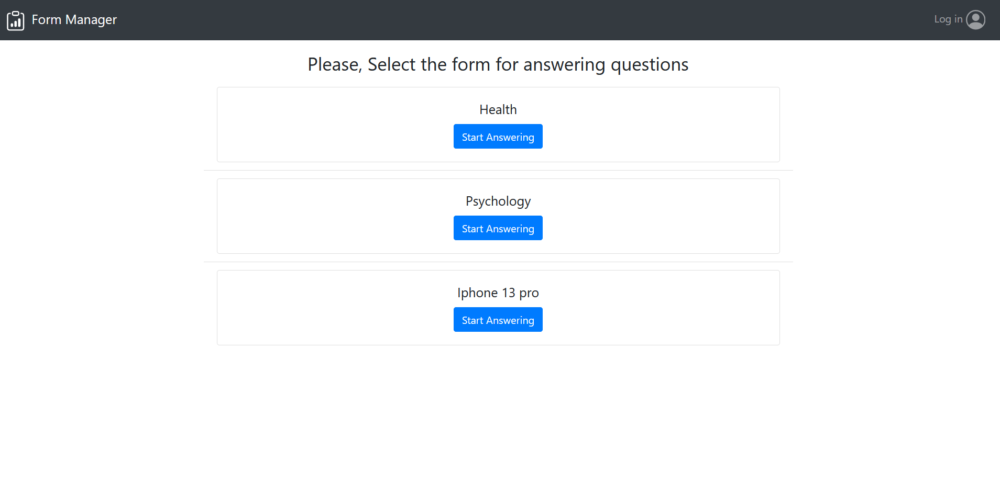
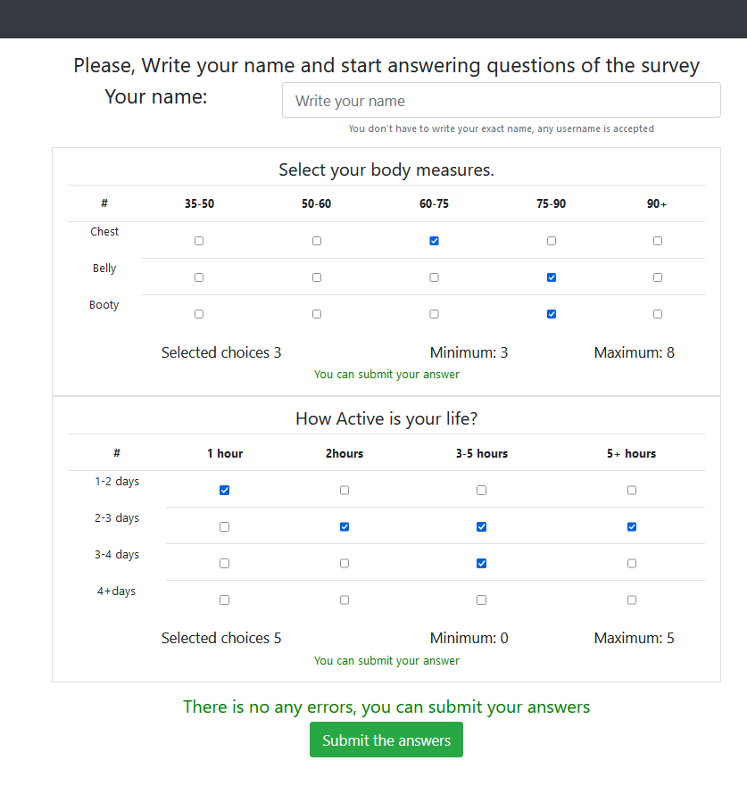
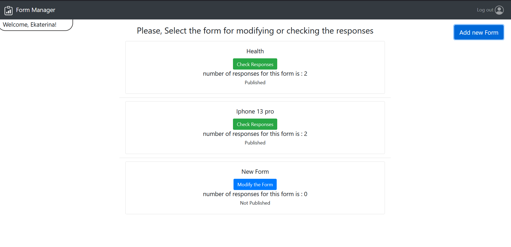
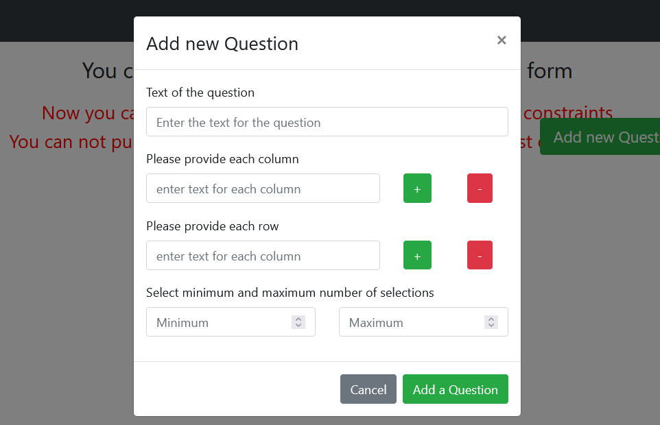
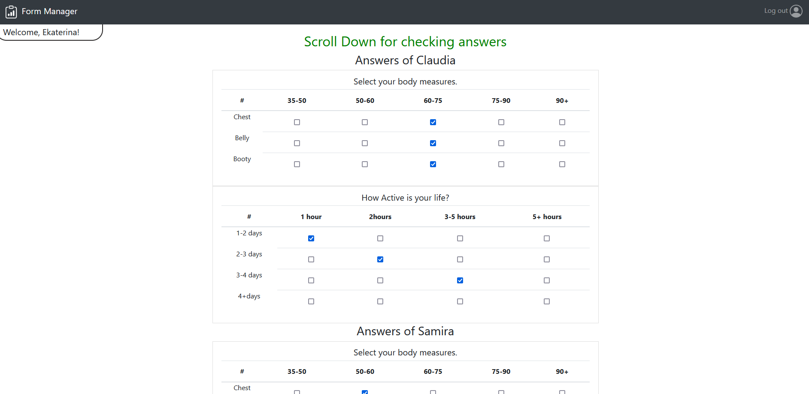

# Web application "Forms Creator"

Web application for Creating forms and for Answering to them.
## Developer: Atabay Heydarli 

## How to run it:

Use these npm scripts to install and run the project: 

1. clone the repository
2. `cd namedirectory`
3. `cd client → npm install`
4. `cd .. → cd server → npm install`
5. `cd client → npm start`
6. (open another terminal window) `cd server npm start`

The application should now run at [http://localhost:3000](http://localhost:3000/) of the browser

## React Client Application Routes

- Route `/`: redirects to the route: /forms
- Route `/forms`: where the list of forms is representing
- Route `/questions`: where user and admin can see questions
- Route `/answers`: where answers of the forms are shown to the admin
- Route `/login`: from where registered users can login to the system

## API Server

### APIs of Forms

- GET `/api/forms`
  - request parameters: /
  - response body: array with forms(
    {"id": 1,
    "title": "Health",
    "num": 2,
    "published": 1,
    "user": 1 })
    or object with error
- POST `/api/forms`
  - request parameters and request body content : 
  {"title": "Health",
    "num": 2,
    "published": 1,
    "user": 1 }
  - response body content : error object or the id of the new form

- PUT `/api/forms/update/published/:formId` - Publishing the form
  - request parameters and request body content : params= formId
  - response body content : `Database error during the update of form ${formId}` and error object
- PUT `/api/forms/update/number/:formId` - Increasing the number of users who respong to selected form
  - request parameters and request body content : params= formId
  - response body content : `Database error during the update of form ${formId}` and error object

  ### APIs of questions

- GET `/api/questions/form/:formId` - Getting questions of selected form
  - request parameters: params= formId
  - response body: array with questions(
   { "question_id":1,
     "text":"This is test Question",
     "columns":"One;Two;Three", 
     "rows":"four;five;six",
     "form_id":2,
     "min":2,
     "max":5 }
)
    or object with error
- POST `/api/questions`
  - request parameters and request body content : 
  { "text":"This is test Question",
     "columns":"One;Two;Three", 
     "rows":"four;five;six",
     "form_id":2,
     "min":2,
     "max":5 }
  - response body content : error object or the id of the new question

- DELETE `/api/questions/delete/:questionId` - Deleting the question
  - request parameters and request body content : params= questionId
  - response body content : `Selected question with id:${id} was deleted`
    `Error while deleting the question with id:${id} ` and error object

- GET `/api/questions/errors/:formId` - Counting questions of selected form with minimum more than 1
  - request parameters and request body content : params= formId
  - response body content : {"possibleErrors":1}

### APIs of Answers

- GET `/api/answers/form/:formId` - Getting answers of selected form
  - request parameters: params= formId
  - response body: array with answers(
   { "id":1,
     "name":"Orkhan", 
     "form_id":3, 
     "question_id":4,
     "answers":"00;11;20",
     "code":628 }
)
    or object with error
- POST `/api/answers`
  - request parameters and request body content : 
  { "name":"Orkhan", 
     "form_id":3, 
     "question_id":4,
     "answers":"00;11;20",
     "code":628 }
  - response body content : error object or the id of the new question

## Database Tables

- Table `users` - contains `id` `email` `name` `hash`
- Table `answers` - contains `id` `name` `form_id` `question_id` `answers` `code`
- Table `question` - contains `question_id` `text` `columns` `rows` `form_id` `min` `max`
- Table `forms` - contains `id` `title` `num` `published` `user` 

## Main React Components

- `Navigation` (in `Navigation.js`): Navigation bar where the name of app is shown and with links to the various routes(main page& log in Log out)
- `LoginComponent` (in `LoginComponent.js`): Realizes the authentication of users, by checking inserted credentials and showing errors if there is any
- `FormsList` (in `FormsList.js`): Using for creating and showing the forms
- `Questions` (in `Questions.js`): Creates a list of questions, show all questions. Where user can answer the form, and admin can modify them.
- `Answers` (in `Answers.js`): Represents answers of the form, for the admin of selected form

(only _main_ components, minor ones may be skipped)

## Screenshot

### Page showing forms for the user

### Page showing questions for the user, and make users answer to them

### Page showing form for the authenticated users

### Page showing questions for authenticated user, and make admins to modify questions

### Page where admin can check early submitted answers

## Users Credentials

| Email address    | Password  |
| :--------------- | :-------: |
| ekaterina@form.it | ekaterina1 |
| admin@form.it  | admin1  |
